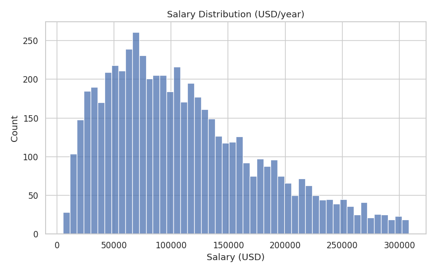
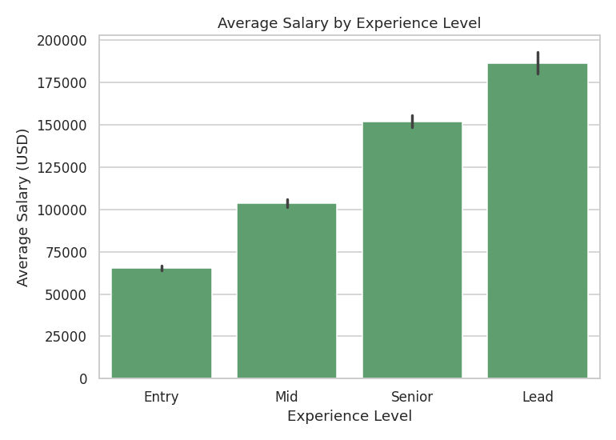
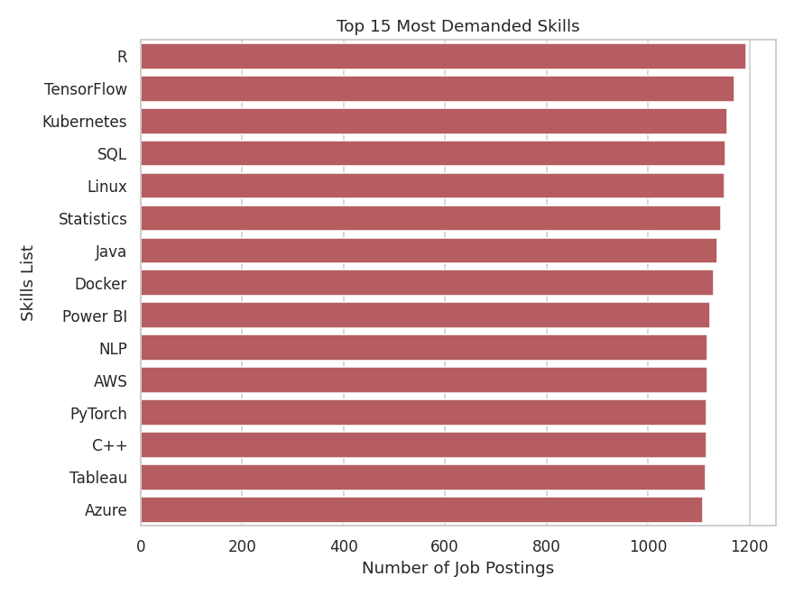

# 📊 Job Market Analysis & Salary Prediction

An end-to-end AI/ML project that analyzes AI/ML & tech job-market data and predicts expected salary based on job title, experience, skills, location, industry, and more — complete with a full data-cleaning pipeline, exploratory data analysis, machine-learning model comparison, and an interactive Streamlit dashboard.

> **Dataset disclosure:** No verified real-world job-market dataset was available in this environment, so a **realistic synthetic dataset** (6,000+ simulated job postings) was generated programmatically (`src/data_processing.py`). Salaries are simulated from role-based salary anchors combined with realistic multiplicative effects for experience, location, industry, company size, education, and employment type, plus random noise — this is disclosed clearly here and in the dashboard itself. No results anywhere in this project are hard-coded; every metric is computed from an actual run of the pipeline.

---

## 1. Project Overview

This project simulates a realistic recruiting/labor-market analytics tool. It ingests job-posting data, cleans and standardizes it, explores salary and market trends, trains and compares multiple regression models to predict salary, and serves everything through a multi-page interactive dashboard — including a natural-language-free "Job Role Explorer" for deep-diving into a specific role.

## 2. Problem Statement

Job seekers and recruiters lack an easy way to answer: *"What salary should I expect (or offer) for this role, given this experience, location, and skill set — and what does the broader job market look like right now?"* This project builds a reproducible pipeline and tool to answer both questions from data.

## 3. Objectives

- Clean and standardize messy, real-world-style job-market data
- Explore salary and hiring trends across roles, locations, industries, and skills
- Train and fairly compare multiple ML models for salary prediction
- Provide an interactive tool for salary prediction with a data-driven range and explanation
- Package everything in a professional, portfolio-ready structure

## 4. Features

- Synthetic-but-realistic dataset generator (clearly disclosed)
- Full data-cleaning pipeline (missing values, duplicates, invalid salaries, outliers, normalization, encoding)
- Exploratory data analysis across salary, job-market composition, and skills
- 3 trained & compared regression models (Linear Regression, Random Forest, Gradient Boosting)
- Automatic best-model selection based on held-out R²
- Data-driven salary range (derived from the best model's own test-set RMSE, not an arbitrary %)
- Feature-importance-based explanations ("Important Factors")
- 7-page Streamlit dashboard, including an advanced **Job Role Explorer**
- Optional PostgreSQL persistence layer (fully optional — pipeline runs without it)

## 5. Dataset

Synthetic dataset with the following fields:

```
Job Title, Company, Location, Experience Level, Years of Experience,
Employment Type, Remote Ratio, Industry, Company Size, Education Level,
Skills, Salary, Currency
```

- **Raw rows generated:** 6,090 (`data/raw/jobs_raw.csv`)
- **Rows after cleaning:** 5,780 (`data/processed/jobs_clean.csv`)
- 15 job titles, 13 locations, 10 industries, 25-skill pool, 15 companies
- Intentional messiness injected (typos in casing, missing values, duplicates, a few invalid/outlier salaries) so the cleaning pipeline has real work to do

## 6. Data Cleaning

Implemented in `src/data_processing.py`, run via `notebooks/01_data_cleaning.ipynb`:

| Step | Approach | Result (this run) |
|---|---|---|
| Duplicate removal | `drop_duplicates()` | 89 rows removed |
| Job-title / location standardization | Title-casing, fixing ALL-CAPS entries | applied to all rows |
| Invalid salary detection | Removed salary ≤ 0 | 15 rows removed |
| Salary normalization | Converted all currencies to `Salary_USD` using FX rates | applied to all rows |
| Outlier detection | IQR method (1.5×IQR) on normalized salary | 206 rows removed |
| Missing values | Median impute (numeric), mode impute (categorical), "Not Specified" (skills) | 0 missing after cleaning |
| Experience/education encoding | Ordinal mapping (Entry→0 … Lead→3, High School→0 … PhD→3) | applied to all rows |
| Skill preprocessing | Parsed comma-separated skills into a list + skill count | applied to all rows |

Final cleaned dataset: **5,780 rows**, 0 missing values, 0 duplicates, 0 invalid/outlier salaries.

## 7. Exploratory Data Analysis

Full analysis in `notebooks/02_eda.ipynb` and the dashboard's Analytics pages. Headline numbers from this run:

- **Average salary:** ~$111,452/year
- **Median salary:** ~$98,978/year
- **Most common job role:** BI Analyst (roles are near-evenly distributed by design)
- **Most in-demand skill (from data):** R, closely followed by TensorFlow, Kubernetes, SQL, Linux, Statistics, Java, Docker, and Power BI (all within ~1,120–1,193 postings out of 5,780)

Sample charts (regenerate with the notebooks for the latest run):





## 8. Machine Learning Approach

- **Preprocessing pipeline** (`sklearn.compose.ColumnTransformer`):
  - Numeric features (`Years of Experience`, `Remote Ratio`, `Skill Count`) → median impute + standard scale
  - Categorical features (`Job Title`, `Location`, `Experience Level`, `Employment Type`, `Industry`, `Company Size`, `Education Level`) → most-frequent impute + one-hot encode
  - Top-15 skill flags → passed through as binary features
- **Train/test split:** 80/20, `random_state=42` (fully reproducible)
- **Models trained:** Linear Regression, Random Forest Regressor, Gradient Boosting Regressor

## 9. Model Comparison

Actual results from this run (`models/metadata.json`, test set of 1,156 rows):

| Model | MAE | RMSE | R² |
|---|---|---|---|
| Linear Regression | $18,424.65 | $24,658.89 | 0.8670 |
| Random Forest | $19,299.97 | $26,723.96 | 0.8438 |
| **Gradient Boosting (selected)** | **$12,630.40** | **$17,771.95** | **0.9309** |

**Gradient Boosting** was automatically selected as the best model (highest R² on the held-out test set) and is the model saved as `models/best_model.joblib`.

## 10. Salary Prediction

`src/prediction.py` loads the saved best model + metadata and:

1. Builds the exact feature row the model expects from user input
2. Predicts salary
3. Computes a **data-driven salary range** = predicted salary ± the best model's own test-set RMSE (not an arbitrary percentage)
4. Returns the top contributing factors, ranked by the trained model's actual feature importances

Example (from `python src/prediction.py`):
```json
{
  "predicted_salary": 132241.07,
  "salary_range": [114469.12, 150013.02],
  "model_used": "Gradient Boosting",
  "important_factors": [
    {"factor": "Years of Experience", "importance": 0.2231},
    {"factor": "Location: Hyderabad, India", "importance": 0.1399},
    ...
  ]
}
```

## 11. Dashboard

A 7-page Streamlit app (`dashboard/app.py`):

1. **Overview** — total jobs, avg/median salary, top role & skill
2. **Job Market Analytics** — jobs by location/experience/employment type, remote vs onsite, top roles & skills
3. **Salary Analytics** — salary distribution, by experience, role, location, industry, company size
4. **Salary Prediction** — interactive form → predicted salary, range, model used, top factors
5. **Skills Analysis** — top skills, skills by role, skills by location, skill → salary relationship
6. **ML Model Performance** — model comparison table & charts, actual vs predicted, feature importance
7. **Job Role Explorer** *(advanced feature)* — pick a role → avg/median salary, salary range, top skills, experience distribution, popular locations, remote %, top hiring companies

## 12. Technology Stack

Python · Pandas · NumPy · Scikit-learn · Matplotlib · Seaborn · Plotly · Streamlit · PostgreSQL (optional) · Joblib

## 13. Project Architecture

```
job-market-salary-prediction/
│
├── data/
│   ├── raw/                 # generated raw synthetic data
│   └── processed/           # cleaned data used for EDA & modeling
│
├── notebooks/
│   ├── 01_data_cleaning.ipynb
│   ├── 02_eda.ipynb
│   └── 03_model_training.ipynb
│
├── src/
│   ├── data_processing.py   # dataset generation + cleaning
│   ├── feature_engineering.py
│   ├── model_training.py    # trains & compares models, saves artifacts
│   ├── prediction.py        # loads best model, serves predictions
│   ├── visualization.py     # shared Plotly chart builders
│   └── db.py                # optional PostgreSQL persistence
│
├── models/                  # saved .joblib models + metadata.json
│
├── dashboard/
│   └── app.py                # Streamlit dashboard (7 pages)
│
├── docs/screenshots/         # sample chart images for this README
├── requirements.txt
├── README.md
├── .gitignore
└── .env.example
```

## 14. Installation

```bash
git clone <your-repo-url>
cd job-market-salary-prediction
python -m venv venv
source venv/bin/activate        # Windows: venv\Scripts\activate
pip install -r requirements.txt
```

## 15. How to Run

```bash
# 1. Generate + clean the dataset
python src/data_processing.py

# 2. Train & evaluate the models (saves models/ + metadata.json)
python src/model_training.py

# 3. (Optional) sanity-check a single prediction from the command line
python src/prediction.py

# 4. Launch the dashboard
streamlit run dashboard/app.py
```

Or explore the same steps interactively via the notebooks in `notebooks/`.

**Optional PostgreSQL:** copy `.env.example` to `.env`, fill in your DB credentials, then run `python src/db.py` to create tables, and use `src/db.py`'s helper functions to load listings / log predictions. Everything else works fully without a database.

## 16. Screenshots

See `docs/screenshots/` for sample EDA charts (salary distribution, salary by experience, top skills). Run the dashboard locally for the full interactive experience across all 7 pages.

## 17. Results

- Cleaned **5,780** job postings from **6,090** raw synthetic rows
- Compared **3** regression models; **Gradient Boosting** performed best with **R² = 0.9309**, **MAE ≈ $12,630**, **RMSE ≈ $17,772**
- Identified **Years of Experience** and **Location** as the strongest salary drivers in this simulated market, followed by Experience Level and Employment Type
- Built a fully interactive, data-driven salary prediction tool with an explainable "important factors" breakdown

## 18. Future Improvements

- Real-time job-data collection through permitted, ToS-compliant public APIs
- NLP-based skill extraction directly from raw job-description text
- A job-recommendation system based on a candidate's profile
- Personalized career-path and upskilling recommendations
- Salary-negotiation insight generation (e.g., "you're likely underpaid by X% for this role/location")
- Time-series job-market trend tracking (postings & salary over time, not just a snapshot)

---

## Resume Bullets (ATS-Friendly)

- Engineered an end-to-end salary-prediction pipeline in **Python** using **Pandas** and **NumPy**, cleaning 6,000+ job records (deduplication, outlier removal via IQR, missing-value imputation, currency normalization) into an analysis-ready dataset.
- Performed exploratory **data analysis and visualization** (Matplotlib, Seaborn, Plotly) on job-market data to surface salary trends by experience, role, location, and industry, and identify in-demand skills.
- Trained and benchmarked **Linear Regression, Random Forest, and Gradient Boosting** models with **Scikit-learn** using a Pipeline + ColumnTransformer, achieving an **R² of 0.93** and **MAE of ~$12.6K** with the best model on held-out test data.
- Built and deployed a 7-page interactive **Streamlit** dashboard for job-market analytics, skills analysis, and real-time salary prediction with model-driven, explainable salary ranges and feature-importance insights.
